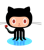

  

  

    

      
      <strong class="highlight">Github</strong>
    

    

      <a href="https://github.com/dynjs/dynjs">dynjs</a> repository is open for contribution and evaluation. Don't be shy!
    

  

  

    

      
      <strong class="highlight">dev mailing list</strong>
    

    
Subscribe our <a href="http://groups.google.com/group/dynjs-dev">mailing list</a> and join us for technical discussions and suggestions. We appreciate feedback.

  

  

    

      <images src="img/icons/codehaus.gif"/>
      <strong class="highlight">Issue Tracker</strong>
    

    
Our <a href="https://jira.codehaus.org/browse/DYNJS">Issue Tracker</a> is kindly supported by the fine folks at <a href="http://codehaus.org">codehaus</a>.

  

  

    

      <images src="img/icons/twitter50x50.png"/>
      <strong class="highlight">Twitter</strong>
    

    
Follow <a href="http://twitter.com/dynjs">@dynjs</a> for news and updates.

  

  

    

      <images src="img/icons/cloudbees101x50.png"/>
      <strong class="highlight">CloudBees</strong>
    

    
<a href="http://dynjs.ci.cloudbees.com">Our continuous integration (CI) server</a> is hosted by <a href="http://www.cloudbees.com/">CloudBees</a>, a nice cloud-hosted version of the Jenkins tooling to keep us sane.

  

